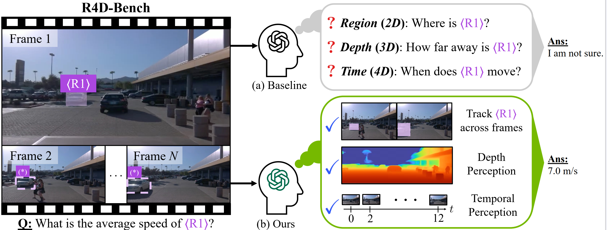

# 4D-RGPT: Toward Region-level 4D Understanding via Perceptual Distillation

<h1 align="center"> 
    
</h1>

[Chiao-An Yang*](https://www.ca-joe-yang.com/), [Ryo Hachiuma](https://scholar.google.com/citations?user=W1KPqGEAAAAJ), [Sifei Liu](https://sifeiliu.net/), [Subhashree Radhakrishnan](https://scholar.google.com/citations?user=bdlaQjkAAAAJ), [Raymond A. Yeh](https://raymond-yeh.com/), [Yu-Chiang Frank Wang](http://vllab.ee.ntu.edu.tw/ycwang.html), [Min-Hung Chen](https://minhungchen.netlify.app/) <br>
(*Work done during the internship at NVIDIA Research)

[](https://www.ca-joe-yang.com/resource/projects/4D_RGPT/)
[](https://arxiv.org/abs/2512.17012)
[](https://huggingface.co/papers/2512.17012)

This is the official repository for the **CVPR'26** paper **[4D-RGPT: Toward Region-level 4D Understanding via Perceptual Distillation](https://arxiv.org/abs/2512.17012)**. 

---

## 📖 Introduction

Despite advances in Multimodal LLMs (MLLMs), their ability to reason over 3D structures and temporal dynamics remains limited, constrained by weak 4D perception and temporal understanding. Furthermore, existing 3D and 4D Video Question Answering (VQA) benchmarks emphasize static scenes and lack region-level prompting. 

To tackle these issues, we introduce:
- **4D-RGPT**: A specialized MLLM designed to capture 4D representations from video inputs with enhanced temporal and spatial perception.
- **Perceptual 4D Distillation (P4D)**: A training-only framework that transfers 4D representations (e.g., depth, optical flow) from a frozen expert model into 4D-RGPT for comprehensive 4D perception—without introducing any additional inference cost.
- **R4D-Bench**: A rigorous benchmark for depth-aware dynamic scenes featuring region-level prompting, built via a hybrid automated and human-verified pipeline.

Our experiments demonstrate that 4D-RGPT achieves notable improvements over strong baselines on existing 3D/4D benchmarks (***+5.3%*** on average across 6 benchmarks) as well as our proposed region-based R4D-Bench (***+4.3%***).

## 💥 News 💥

- [ ] **[Upcoming]** Training and Inference Code release.
- [ ] **[Upcoming]** 4D-RGPT Model Weights release.
- [ ] **[Upcoming]** R4D-Bench Dataset release.
- [x] **[Feb 2026]** 🔥🔥 4D-RGPT is accepted to CVPR 2026! 🎉🎉
- [x] **[Dec 2025]** Initial paper, [Project Page](https://www.ca-joe-yang.com/resource/projects/4D_RGPT/), and [Hugging Face page](https://huggingface.co/papers/2512.17012) released.

*(Please watch/star this repository to stay updated on the code and dataset releases!)*

---

## Citation
If you find our work useful, please consider giving a star and citation:
```bibtex
@article{yang20254d,
  title={4D-RGPT: Toward Region-level 4D Understanding via Perceptual Distillation},
  author={Yang, Chiao-An and Hachiuma, Ryo and Liu, Sifei and Radhakrishnan, Subhashree and Yeh, Raymond A and Wang, Yu-Chiang Frank and Chen, Min-Hung},
  journal={arXiv preprint arXiv:2512.17012},
  year={2025}
}
```

## Licenses

Copyright © 2026, NVIDIA Corporation. All rights reserved.

This work is made available under the NVIDIA Source Code License-NC. Click [here](LICENSE) to view a copy of this license.
